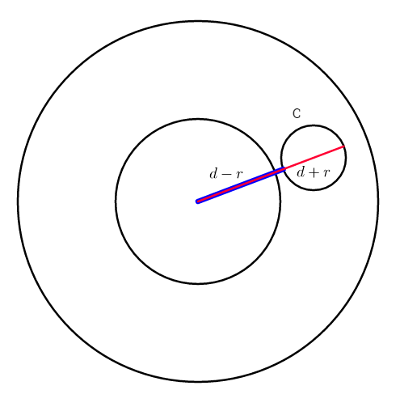

# Problem A
We have to answer to 'given 4 integers l, r, x, y and given an integer k, are there any two integers a, b such that k = a/b, l <= a <= r and x <= b <= y?'.  
Since l, r, x, y are small we can check for every b in [x, y] if l <= k*b = a <= r
# Problem B
We have to answer if a circle C lies completely in an annolus.  
We just need to check if the distance between C and the center of the inner circle (d) minus the radius of C (r) is more than the radius of the inner circle and d + r is less than the radius of the outer circle.  

# Problem C
Wrong for now